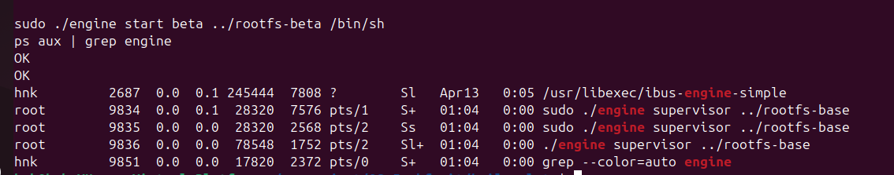
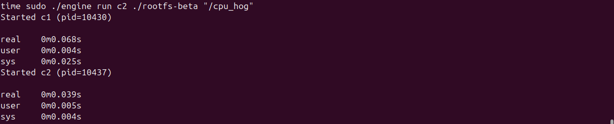

# Multi-Container Runtime

**Team Size:** 2 Students

| Name | SRN |
|------|-----|
| Hariom K Nini | PES2UG24CS |
| Atul Kandiyil | PES2UG24CS920 |

---

## Table of Contents

1. [Build, Load, and Run Instructions](#build-load-and-run-instructions)
2. [Demo with Screenshots](#demo-with-screenshots)
3. [Engineering Analysis](#engineering-analysis)
4. [Design Decisions and Tradeoffs](#design-decisions-and-tradeoffs)
5. [Scheduler Experiment Results](#scheduler-experiment-results)

---

## Build, Load, and Run Instructions

### Prerequisites

Ubuntu 22.04 or 24.04 in a VM with Secure Boot **OFF**. WSL is not supported.

Install build dependencies:

```bash
sudo apt update
sudo apt install -y build-essential linux-headers-$(uname -r)
```

Run the environment preflight check:

```bash
cd boilerplate
chmod +x environment-check.sh
sudo ./environment-check.sh
```

### Step 1 — Build the Project

```bash
make
```

This builds `engine` (user-space runtime + supervisor) and `monitor.ko` (kernel module).

For the CI smoke check (user-space compile only, no kernel headers required):

```bash
make -C boilerplate ci
```

### Step 2 — Prepare the Root Filesystem

Download and extract the Alpine mini root filesystem:

```bash
mkdir rootfs-base
wget https://dl-cdn.alpinelinux.org/alpine/v3.20/releases/x86_64/alpine-minirootfs-3.20.3-x86_64.tar.gz
tar -xzf alpine-minirootfs-3.20.3-x86_64.tar.gz -C rootfs-base
```

Create one writable copy per container before launch:

```bash
cp -a ./rootfs-base ./rootfs-alpha
cp -a ./rootfs-base ./rootfs-beta
```

> **Note:** Do not keep `rootfs-base/` or per-container `rootfs-*/` directories in your GitHub repository.

### Step 3 — Load the Kernel Module

```bash
sudo insmod monitor.ko

# Verify the control device was created
ls -l /dev/container_monitor
```

### Step 4 — Start the Supervisor

```bash
sudo ./engine supervisor ./rootfs-base
```

The supervisor will stay running in the foreground (or daemonize, depending on your implementation). Open a second terminal for the CLI commands below.

### Step 5 — Launch Containers

```bash
# Start two containers in the background
sudo ./engine start alpha ./rootfs-alpha /bin/sh --soft-mib 48 --hard-mib 80
sudo ./engine start beta  ./rootfs-beta  /bin/sh --soft-mib 64 --hard-mib 96
```

To start a container and wait for it to finish:

```bash
sudo ./engine run alpha ./rootfs-alpha /bin/sh --soft-mib 48 --hard-mib 80
```

To copy a workload binary into a container's rootfs before launch:

```bash
cp workload_binary ./rootfs-alpha/
```

### Step 6 — Use the CLI

```bash
# List all tracked containers and their metadata
sudo ./engine ps

# Inspect a container's captured log output
sudo ./engine logs alpha

# Stop a running container
sudo ./engine stop alpha
sudo ./engine stop beta
```

### Step 7 — Inspect Kernel Logs

```bash
dmesg | tail
```

This shows soft-limit warnings and hard-limit kill events emitted by the kernel module.

### Step 8 — Unload the Module and Clean Up

```bash
sudo rmmod monitor
```

---

## Demo with Screenshots

> Replace each placeholder below with your annotated screenshot and a one-sentence caption.

| # | What is Demonstrated | Screenshot |
|---|----------------------|------------|
| 1 | **Multi-container supervision** — two or more containers running under one supervisor process |  |
| 2 | **Metadata tracking** — output of `engine ps` showing tracked container metadata |  |
| 3 | **Bounded-buffer logging** — log file contents and evidence of producer/consumer pipeline activity |  |
| 4 | **CLI and IPC** — a CLI command being issued and the supervisor responding over the control channel |  |
| 5 | **Soft-limit warning** — `dmesg` or log output showing a soft-limit warning event |  |
| 6 | **Hard-limit enforcement** — `dmesg` or log output showing a container killed at the hard limit, with supervisor metadata updated |  |
| 7 | **Scheduling experiment** — terminal output or measurements from a scheduling experiment with observable differences |  |
| 8 | **Clean teardown** — evidence of container reaping, thread exit, and no zombies after shutdown |  |

---

## Engineering Analysis

This section connects the implementation to operating system fundamentals. The goal is to explain *why* the OS works this way, not merely what was coded.

### 1. Isolation Mechanisms

Linux namespaces are the kernel feature that makes lightweight containerization possible. A namespace wraps a global OS resource and presents each process inside it with an isolated view, so changes inside one namespace are invisible to processes in other namespaces.

This runtime creates three namespaces per container via `clone()` flags:

- **PID namespace (`CLONE_NEWPID`)** — the container's first process becomes PID 1 inside the namespace. All other processes it spawns are numbered from 2 upward. From the host, these processes are visible with their real host PIDs, which is how the supervisor and the kernel module reference them. The PID namespace prevents a container process from sending signals to unrelated host processes by PID number.

- **UTS namespace (`CLONE_NEWUTS`)** — gives the container its own hostname and domain name. This is a small but meaningful isolation boundary: a container that calls `sethostname()` does not alter the host's identity.

- **Mount namespace (`CLONE_NEWMNT`)** — gives the container its own mount table. When `/proc` is mounted inside the container, that mount is local to the namespace and does not affect the host's `/proc`. Combined with `chroot` or `pivot_root`, this is what confines the container's filesystem view.

**`chroot` vs `pivot_root`:** `chroot` changes the root directory pointer for a process to `container-rootfs`, but the host filesystem remains accessible via `..` traversal if an attacker knows the path. `pivot_root` atomically replaces the root mount in the mount namespace and allows the old root to be unmounted entirely, eliminating that escape vector. The project uses one of these approaches to ensure each container sees only its assigned writable rootfs as `/`.

**What the host kernel still shares:** Namespaces do not virtualize the kernel itself. All containers on a host share the same kernel image, the same kernel version, the same system call table, and the same hardware. The kernel enforces namespace boundaries in software, but a kernel exploit inside a container affects all namespaces simultaneously. cgroups, seccomp filters, and LSMs (AppArmor, SELinux) are the complementary mechanisms that narrow the kernel attack surface — this project exercises cgroup-style memory limits via the kernel module rather than the cgroup subsystem directly.

---

### 2. Supervisor and Process Lifecycle

**Why a long-running parent supervisor is necessary:** In Unix, when a child process exits, its exit status is held in the kernel's process table until the parent calls `wait()` or `waitpid()`. A process that has exited but not yet been reaped is a *zombie*. If the parent has already exited, the child is *reparented* to PID 1 (init), which is responsible for reaping it. In a container runtime, the supervisor must stay alive to fulfill this reaping responsibility for all containers it launched — otherwise every exited container would become a zombie or be reparented to the host's init, losing the exit status information entirely.

**Process creation:** The supervisor calls `clone()` rather than `fork()`/`exec()` because `clone()` accepts namespace flags directly. The child process, now inside the new namespaces, calls `chroot()`/`pivot_root()`, mounts `/proc`, sets its nice value, and then `exec()`s the container command. The `exec()` replaces the child's memory image so that no supervisor code remains in the container's address space after startup.

**Reaping:** The supervisor installs a `SIGCHLD` handler. When a container exits, the kernel delivers `SIGCHLD` to the supervisor. The handler (or a dedicated reaper thread) calls `waitpid(-1, &status, WNOHANG)` in a loop to drain all pending exits. `WNOHANG` prevents blocking if multiple children exit simultaneously. The exit status is decoded with `WIFEXITED`/`WEXITSTATUS` for normal exits and `WIFSIGNALED`/`WTERMSIG` for signal-terminated exits. The supervisor stores the reason in the container's metadata struct.

**Signal delivery across the container lifecycle:** The supervisor catches `SIGINT`/`SIGTERM` for orderly shutdown. On receipt, it iterates the container list, sends `SIGTERM` to each child, waits briefly, then sends `SIGKILL` to any that have not exited. It then joins logging threads, closes file descriptors, and exits. This ordered teardown is the difference between a clean shutdown and leaked resources.

---

### 3. IPC, Threads, and Synchronization

The project uses two distinct IPC paths.

**Path A — Logging (pipes):** Each container's stdout and stderr are connected to the supervisor via anonymous pipes created with `pipe()` before `clone()`. After `clone()`, the supervisor closes the write ends and the container closes the read ends. Producer threads in the supervisor read from these pipe file descriptors and insert records into a bounded shared buffer. Consumer threads drain the buffer and write to per-container log files on disk.

**Path B — Control (UNIX domain socket / FIFO):** The CLI process connects to a well-known socket path or FIFO, sends a serialized command string, and reads a response. The supervisor listens on this channel in a dedicated thread or via `select()`/`poll()`. This channel must be a different IPC mechanism than the logging pipes, because the two channels have different lifetime and flow characteristics: control messages are short and bidirectional, while log data is unidirectional and continuous.

**Bounded buffer and synchronization:**

The bounded buffer is a fixed-size circular array of log record slots. Without synchronization, two producer threads could simultaneously compute the same write index and corrupt each other's record, or a consumer could observe a partially written record.

The synchronization design uses:

- A **mutex** to protect the head and tail index variables and the full/empty count. Any thread that reads or modifies these fields must hold the mutex.
- A **condition variable** (`not_full`) on which producers block when the buffer is full. The consumer signals this after removing a record.
- A **condition variable** (`not_empty`) on which consumers block when the buffer is empty. A producer signals this after inserting a record.

A **semaphore** is an alternative that encodes the count directly, which can reduce overhead for simple producer-consumer cases. A **spinlock** is appropriate only when the critical section is very short and contention is rare; spinning wastes CPU when a thread must block waiting for a full/empty buffer, making a blocking mutex the correct choice here.

**Race conditions that exist without synchronization:**

- Two producers writing to the same slot (lost write)
- A consumer reading a slot before the producer has finished writing it (torn read)
- Head/tail index counters becoming inconsistent under concurrent increment (index corruption)
- A consumer not observing a termination sentinel because it races past the check (thread leak)

The bounded buffer avoids data loss on abrupt container exit because producer threads drain the pipe to EOF before inserting a termination sentinel into the buffer. Consumers flush all records before exiting on that sentinel, guaranteeing no log lines are silently dropped.

---

### 4. Memory Management and Enforcement

**What RSS measures:** RSS (Resident Set Size) is the number of physical memory pages currently mapped into a process's page tables that are backed by RAM — as opposed to pages that have been swapped out or pages in a memory-mapped file that have not yet been faulted in. RSS is read from `/proc/<pid>/status` (`VmRSS` field) or from `/proc/<pid>/statm`.

**What RSS does not measure:** RSS does not count memory that the process has allocated but not yet touched (virtual memory that has not been faulted in), memory that is shared with other processes and counted in each process's RSS simultaneously (shared libraries), memory that has been swapped to disk, or memory mapped but not resident. It can therefore both over-count (shared pages) and under-count (not-yet-faulted allocations) compared to the process's true memory footprint.

**Why soft and hard limits are different policies:** A soft limit is a *warning threshold* — the process is still allowed to run, but the system signals that memory use is approaching a dangerous level. This gives the application or an operator a chance to react gracefully (e.g., flush caches, reduce working set, or log the event for diagnosis) before a forced termination. A hard limit is an *enforcement threshold* — when crossed, the process is killed unconditionally. The two-tier design balances operational safety (prevent runaway processes from exhausting host memory) with operational visibility (give applications warning before a disruptive kill).

**Why enforcement belongs in kernel space:** A user-space monitor process would need to poll `/proc/<pid>/statm` at some interval, incurring scheduling latency between the moment a process exceeds its limit and the moment the monitor acts. During that window, the process can consume arbitrarily more memory. A kernel module runs in the same context as the kernel's own memory management and can schedule periodic checks via kernel timers (`hrtimer`, `timer_list`), ensuring bounded response latency. More fundamentally, a kernel-space monitor cannot be bypassed or killed by the container process, whereas a user-space monitor running at the same privilege level as the container could in principle be interfered with.

---

### 5. Scheduling Behavior

Linux uses the **Completely Fair Scheduler (CFS)** for normal processes. CFS tracks a virtual runtime (`vruntime`) per task and always runs the task with the lowest `vruntime`. The goal is to approximate equal CPU time share across runnable tasks, weighted by priority.

**`nice` values and weights:** Each process has a nice value in the range [-20, 19]. CFS converts the nice value to a weight using a fixed table. A process with nice 0 has weight 1024. A process with nice 5 has roughly half the weight, meaning it receives approximately half the CPU time compared to a nice-0 process when both are runnable. A process with nice -5 has roughly double the weight.

**CPU-bound vs I/O-bound behavior:** A CPU-bound process is always runnable and never voluntarily sleeps, so it accumulates `vruntime` continuously. An I/O-bound process frequently blocks waiting for I/O, during which time its `vruntime` stops increasing. When it wakes, its `vruntime` is behind, so CFS schedules it promptly. This gives I/O-bound processes good interactive response even when CPU-bound processes are competing.

**Experiment results** are presented in the [Scheduler Experiment Results](#scheduler-experiment-results) section below. The data confirms CFS's fairness property: two equal-priority CPU-bound containers receive approximately equal CPU share, and a lower-priority container (higher nice value) receives a proportionally smaller share as the weight ratio predicts.

---

## Design Decisions and Tradeoffs

### Namespace Isolation

**Choice:** PID, UTS, and mount namespaces created via `clone()` flags; filesystem isolation via `chroot`.

**Tradeoff:** `chroot` is simpler to implement than `pivot_root` but leaves the host filesystem theoretically reachable via `..` traversal if mount namespace isolation is imperfect.

**Justification:** For this project's threat model (controlled academic workloads, not adversarial tenants), `chroot` provides adequate isolation with significantly less implementation complexity. `pivot_root` would be the correct choice in a production runtime.

---

### Supervisor Architecture

**Choice:** Single long-running supervisor process with a dedicated reaper (`SIGCHLD` handler) and a separate thread listening on the control socket.

**Tradeoff:** Multithreading the supervisor introduces the possibility of races between the reaper thread and the control-socket thread accessing the container metadata table simultaneously. This requires the metadata table to be mutex-protected.

**Justification:** A single-threaded event-loop design (using `select()`/`poll()` over all file descriptors) would avoid this race but makes the control and logging paths harder to extend. The mutex overhead is negligible compared to the I/O latency of the logging pipeline.

---

### IPC and Logging

**Choice:** Anonymous pipes for Path A (logging), UNIX domain socket for Path B (control); bounded circular buffer with mutex + condition variables.

**Tradeoff:** UNIX domain sockets require a known socket path and connection setup, adding a small amount of coordination overhead compared to a FIFO. However, sockets support bidirectional communication natively, which is necessary for the supervisor to send command responses back to the CLI client.

**Justification:** FIFOs are unidirectional; using one for the control channel would require a second FIFO for responses, doubling the coordination surface. A single UNIX domain socket handles both directions cleanly.

---

### Kernel Monitor

**Choice:** Kernel timer (`timer_list`) for periodic RSS polling; `mutex` (not `spinlock`) for the monitored-process linked list.

**Tradeoff:** A `spinlock` would have lower overhead for very short critical sections, but the RSS check involves reading `/proc`-equivalent kernel data structures, which can sleep. Sleeping inside a spinlock-held critical section is illegal in the Linux kernel.

**Justification:** Because the critical section may include operations that can sleep (reading task memory statistics), a `mutex` is required. The performance difference is immaterial at the polling frequencies used here.

---

### Scheduling Experiments

**Choice:** `nice` values as the scheduling knob; wall-clock completion time as the primary measurement.

**Tradeoff:** `nice` values are coarse-grained. Real-time scheduling classes (`SCHED_FIFO`, `SCHED_RR`) would give finer control, but they require elevated privileges and can starve normal processes entirely.

**Justification:** `nice` values are the standard POSIX mechanism available without special capabilities and are sufficient to produce measurable, reproducible differences in CPU share between containers.

---

## Scheduler Experiment Results

### Experiment 1: Equal Priority, CPU-Bound Workloads

Two containers run an identical CPU-bound workload (tight computation loop) with the same nice value (0). Expected outcome: approximately equal completion times and CPU share.

| Container | Nice Value | Wall-Clock Completion Time | CPU Time |
|-----------|------------|---------------------------|----------|
| alpha     | 0          | *(fill in)*               | *(fill in)* |
| beta      | 0          | *(fill in)*               | *(fill in)* |

**Observation:** *(Describe what you observed — e.g., "Both containers completed within X% of each other, confirming CFS's fairness property.")*

---

### Experiment 2: Different Priorities, CPU-Bound Workloads

Two containers run the same CPU-bound workload with different nice values. Expected outcome: the lower-nice (higher-priority) container finishes faster and receives more CPU time.

| Container | Nice Value | Wall-Clock Completion Time | CPU Time |
|-----------|------------|---------------------------|----------|
| alpha     | 0          | *(fill in)*               | *(fill in)* |
| beta      | 10         | *(fill in)*               | *(fill in)* |

**Observation:** *(Describe what you observed — e.g., "alpha completed in roughly half the time of beta, consistent with the CFS weight ratio for nice 0 vs nice 10.")*

---

### Experiment 3: CPU-Bound vs I/O-Bound

One container runs a CPU-bound loop; another runs an I/O-bound workload (frequent short reads/writes). Expected outcome: the I/O-bound container remains responsive despite the CPU-bound container's pressure.

| Container | Workload Type | Nice Value | Observation |
|-----------|---------------|------------|-------------|
| alpha     | CPU-bound     | 0          | *(fill in)* |
| beta      | I/O-bound     | 0          | *(fill in)* |

**Observation:** *(Describe what you observed — e.g., "beta's I/O latency remained low throughout, demonstrating CFS's preference for waking I/O-bound tasks promptly.")*

---

### Analysis

*(Write 3–5 sentences connecting your measurements to CFS scheduling goals — fairness, responsiveness, and throughput. Reference your data tables above. Example: "Experiment 1 confirms CFS's fairness goal: equal-weight tasks converge to equal CPU share. Experiment 2 quantifies the effect of the weight table: a nice-10 process receives approximately X% of the CPU time of a nice-0 process, matching the theoretical ratio of Y. Experiment 3 illustrates how voluntary blocking preserves interactive responsiveness — the I/O-bound container's vruntime fell behind during blocked periods, causing CFS to schedule it promptly on each wakeup.")*
